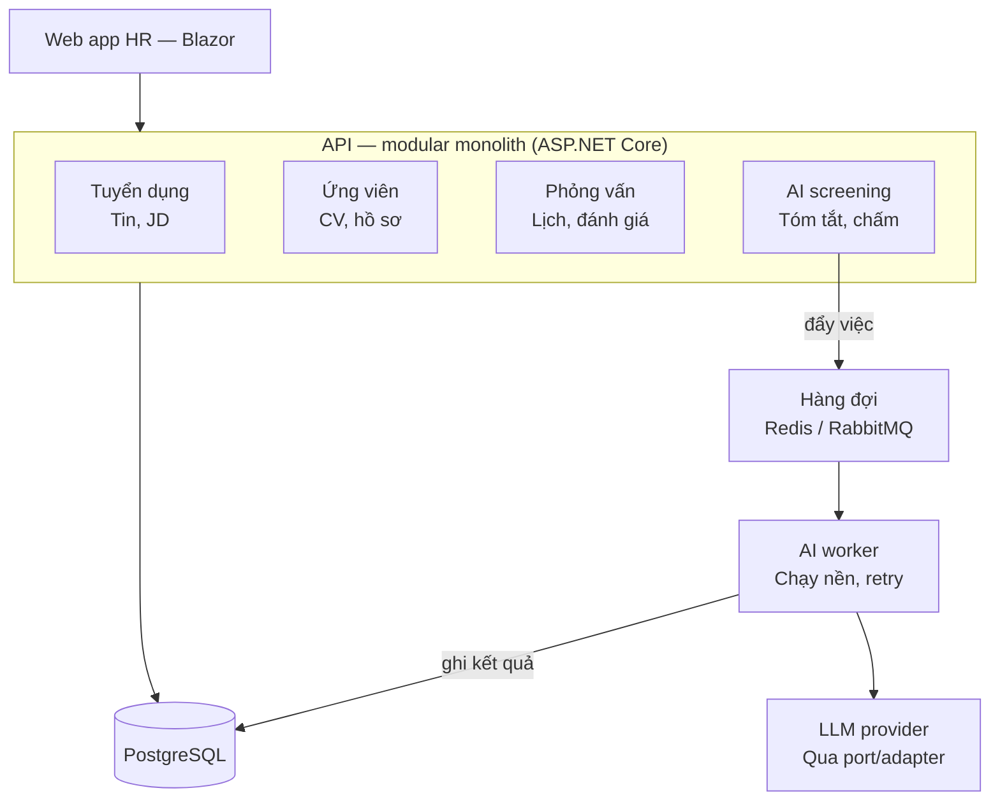
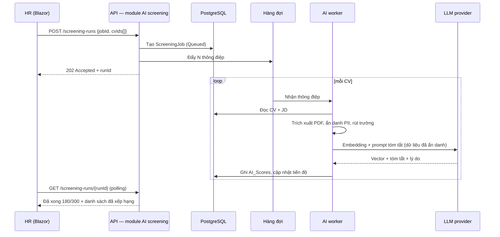
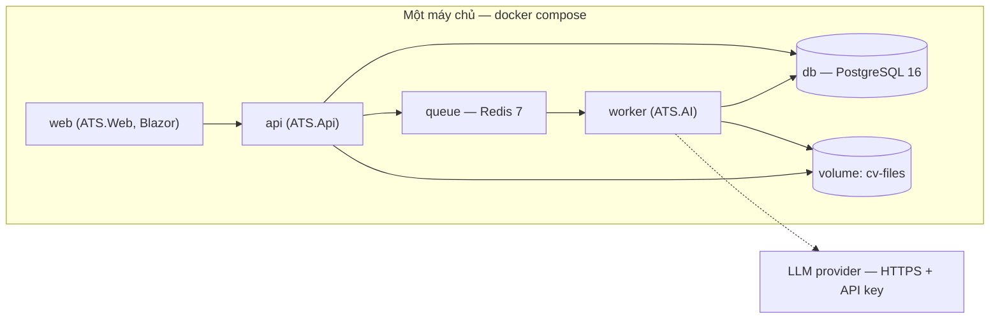

# Kiến trúc hệ thống

> TV1 phụ trách tài liệu này. Cập nhật trong tuần 1–2.
> Tài liệu này đồng thời là **chương Kiến trúc** của báo cáo học phần.

Chương này trình bày kiến trúc theo ba tầng quyết định: **(1)** bối cảnh và ràng buộc buộc phải
chấp nhận, **(2)** ba quyết định kiến trúc cùng phương án thay thế đã cân nhắc và lý do loại bỏ,
**(3)** những đánh đổi nhóm chấp nhận trả giá, kèm dấu hiệu phải xem lại quyết định.

Nguyên tắc viết chương: **không mô tả công nghệ, mà giải thích lựa chọn**. Một sơ đồ chỉ có giá trị
khi trả lời được câu hỏi "vì sao không phải cách khác".

---

## 1. Bối cảnh và ràng buộc

Kiến trúc không tồn tại độc lập — nó là nghiệm của một bài toán tối ưu có ràng buộc. Phần này liệt
kê các ràng buộc, đánh mã `RB*` để các quyết định ở mục 3 tham chiếu trực tiếp.

### 1.1. Quy mô người dùng và tải dự kiến

Hệ thống phục vụ **quy trình tuyển dụng nội bộ của một tổ chức**, không phải một cổng tuyển dụng công cộng.

| Chỉ số | Ước lượng | Ghi chú |
|---|---|---|
| Người dùng có tài khoản | 10 – 50 (HR, nhà tuyển dụng, quản trị) | Không có người dùng ẩn danh quy mô lớn |
| Người dùng đồng thời lúc cao điểm | 5 – 15 | Giờ hành chính, một múi giờ |
| Tin tuyển dụng đang mở | 10 – 30 | |
| CV nhận được mỗi đợt tuyển | 100 – 300 | Đây là **đỉnh tải thật sự** của hệ thống |
| Tổng CV lưu trữ sau 1 năm | ~5.000 | Vài GB file PDF |
| Nghiệp vụ ghi/giây (write QPS) | < 5 | |

**RB1 — Tải nghiệp vụ rất nhỏ; tải AI lại theo lô lớn và đột biến.** Một PostgreSQL và một tiến
trình API dư sức phục vụ toàn bộ nghiệp vụ CRUD. Nhưng khi HR bấm "sàng lọc đợt tuyển này", hệ thống
đột ngột phải xử lý 300 CV — mỗi CV cần trích xuất PDF, gọi embedding và gọi LLM. Đây là hai hình thái
tải hoàn toàn khác nhau **trong cùng một ứng dụng**, và chính sự khác biệt này định hình kiến trúc.

**RB2 — Độ trễ chấp nhận được là bất đối xứng.** Thao tác nghiệp vụ (mở danh sách ứng viên, đổi trạng
thái) phải phản hồi dưới ~2 giây. Ngược lại, HR hoàn toàn chấp nhận chờ vài phút cho kết quả sàng lọc
một lô CV — vì việc thay thế là đọc tay hàng giờ.

### 1.2. Ràng buộc đội ngũ và thời gian

**RB3 — Đội 4 sinh viên kiêm nhiệm, 10 tuần, không ai có kinh nghiệm vận hành production.** Nhóm còn
học các học phần khác; thời gian thực tế cho dự án ước tính 8–12 giờ/người/tuần, tức tổng ngân sách
khoảng **320–480 giờ công cho toàn bộ dự án**, đã bao gồm cả viết báo cáo và làm slide.

**RB4 — Nhóm chia việc theo tầng kiến trúc, không theo module nghiệp vụ** (mục 9.2 của bản tổng kết).
Mỗi thành viên sở hữu trọn một tầng: TV1 dữ liệu và hạ tầng, TV2 nghiệp vụ và API, TV3 giao diện,
TV4 AI và kiểm thử. Hệ quả: **mọi chức năng đều đi xuyên qua tay 3 người**. Kiến trúc phải làm cho
các ranh giới đủ tường minh để 4 người làm song song mà không chặn nhau, thay vì phải họp mỗi khi
đụng nhau.

**RB5 — Không có nhân sự vận hành.** Không ai trong nhóm đủ thời gian để cấu hình service mesh, gỡ lỗi
phân tán, hay trực sự cố. Mọi thứ phải chạy được bằng một lệnh `docker compose up`, trên một máy chủ
duy nhất, và phải khôi phục được bằng cách khởi động lại.

### 1.3. Ràng buộc ngân sách gọi API AI

Đây là ràng buộc bị bỏ qua nhiều nhất trong đồ án sinh viên, và cũng là ràng buộc dễ làm hỏng dự án
nhất — vì nó chỉ lộ ra ở tuần thứ 8, khi hết credit.

Ước lượng cho một lượt chấm một CV:

| Thành phần | Token ước tính |
|---|---|
| Nội dung CV sau khi trích xuất và rút gọn | ~1.500 token đầu vào |
| Mô tả công việc (JD) | ~500 token đầu vào |
| Kết quả sinh ra (tóm tắt + lý do phù hợp) | ~300 token đầu ra |
| **Tổng mỗi lượt chấm** | **~2.000 vào / ~300 ra** |

Suy ra khối lượng cả học phần:

- Một đợt tuyển 300 CV: ~600.000 token vào, ~90.000 token ra.
- Cả học phần, tính cả chạy thử, gỡ lỗi prompt, demo lặp lại: ước **~3.000 lượt chấm** →
  **~6 triệu token vào, ~0,9 triệu token ra**.
- Với đơn giá `p_in` và `p_out` (USD trên 1 triệu token) của nhà cung cấp được chọn, chi phí ước tính là
  `6 × p_in + 0,9 × p_out` USD.

**RB6 — Ngân sách là tiền túi sinh viên, nhóm tự đặt trần khoảng 20–30 USD cho cả học phần.** Con số
này nhỏ, nhưng điều đáng nói không phải là độ lớn mà là **tính chất** của nó: chi phí tỉ lệ thuận với
số lần gọi, và một vòng lặp thử prompt sai có thể đốt sạch ngân sách trong một buổi tối. Kiến trúc do
đó bắt buộc phải có ba thứ: **cache kết quả theo khoá bất biến**, **hạn mức số lượt gọi**, và **khả
năng đổi sang mô hình rẻ hơn mà không sửa mã nghiệp vụ**.

**RB7 — Phụ thuộc nhà cung cấp bên ngoài là rủi ro thật.** API có thể bị rate-limit, timeout, đổi tên
mô hình, hoặc đơn giản là hết credit đúng hôm demo. Kiến trúc phải chịu được việc đó mà hệ thống vẫn
dùng được.

### 1.4. Ràng buộc dữ liệu và tuân thủ

**RB8 — CV chứa dữ liệu cá nhân (PII).** Họ tên, số điện thoại, email, địa chỉ, đôi khi cả số CCCD.
Theo Nghị định 13/2023/NĐ-CP về bảo vệ dữ liệu cá nhân, và theo yêu cầu của học phần (mục 2.5: "đưa
dữ liệu nhạy cảm lên AI không kiểm soát" là tình huống **không đạt**), dữ liệu nhạy cảm **phải được
ẩn danh trước khi rời khỏi hệ thống**. Bước ẩn danh vì vậy không phải là một hàm tiện ích — nó là
một **chốt kiến trúc bắt buộc nằm trên đường đi ra ngoài**, không thể đi vòng qua.

**RB9 — Quyết định cuối cùng thuộc về con người.** Điểm AI chỉ là gợi ý sắp xếp. HR luôn phải nhìn
thấy CV gốc, và mọi kết quả AI phải lưu kèm cờ "đã được người xác nhận". Ràng buộc này quyết định
**lược đồ dữ liệu** (bảng `AI_Scores` tách riêng khỏi bảng nghiệp vụ, không bao giờ ghi đè trạng thái
ứng tuyển) chứ không chỉ quyết định giao diện.

### 1.5. Ràng buộc của học phần

**RB10 — Kiến trúc phải nhìn thấy được và chấm được.** Học phần chấm 15% cho "Yêu cầu & kiến trúc",
yêu cầu **tổ chức mã nguồn theo kiến trúc nhiều lớp rõ ràng**, có **Docker**, có **CI/CD**, và AI phải
là **chức năng nghiệp vụ có fallback**. Một kiến trúc "thông minh" nhưng không thể hiện được ranh giới
tầng trong cấu trúc thư mục là một kiến trúc bị mất điểm.

---

## 2. Tổng quan kiến trúc



### 2.1. Vai trò từng thành phần

| Thành phần | Trách nhiệm | Không chịu trách nhiệm |
|---|---|---|
| **Web app HR** | Hiển thị, thu thập thao tác, hiển thị trạng thái xử lý | Không chứa quy tắc nghiệp vụ, không gọi thẳng LLM |
| **API monolith** | Toàn bộ quy tắc nghiệp vụ, xác thực/phân quyền, giao dịch dữ liệu | Không gọi LLM đồng bộ trong request |
| **Module AI screening** | Nhận yêu cầu sàng lọc, tạo bản ghi công việc, đẩy vào hàng đợi, đọc kết quả | Không tự gọi mô hình |
| **Hàng đợi** | Tách nhịp giữa tải đột biến và năng lực xử lý; giữ việc khi worker chết | Không lưu trữ lâu dài |
| **AI worker** | Trích xuất PDF → ẩn danh → embedding → cosine → LLM → ghi điểm; retry, backoff | Không lộ endpoint HTTP ra ngoài |
| **LLM provider** | Sinh tóm tắt và lý do phù hợp | Không bao giờ nhận PII thô |

### 2.2. Vì sao sơ đồ chỉ vẽ 4 module?

Hệ thống có **sáu** nhóm chức năng, nhưng sơ đồ chỉ vẽ bốn — đây là lựa chọn có chủ đích, không phải
thiếu sót:

| Module | Trên sơ đồ? | Lý do |
|---|---|---|
| Tuyển dụng (Job/JD) | Có | Module nghiệp vụ lõi |
| Ứng viên & CV | Có | Module nghiệp vụ lõi |
| Phỏng vấn & quy trình | Có | Module nghiệp vụ lõi |
| AI screening | Có | Module lõi, và là module duy nhất có ràng buộc phi chức năng đặc biệt |
| **Tài khoản & phân quyền** | Không | Là **mối quan tâm xuyên suốt** (cross-cutting), hiện diện ở mọi request qua middleware — vẽ vào sơ đồ sẽ thành đường nối tới tất cả các hộp, làm sơ đồ mất khả năng đọc |
| **Báo cáo & thống kê** | Không | Là **mô hình đọc** (read model): chỉ truy vấn tổng hợp trên dữ liệu của các module khác, không sở hữu dữ liệu riêng, không có quy tắc ghi |

Nói cách khác, sơ đồ vẽ **các module sở hữu dữ liệu và quy tắc ghi**. Hai module còn lại nằm ở hai
chiều khác của hệ thống nên được mô tả riêng, không nhồi vào cùng một mặt phẳng.

---

## 3. Ba quyết định kiến trúc

Mỗi quyết định trình bày theo dạng ADR (Architecture Decision Record): bối cảnh → các phương án đã
cân nhắc → quyết định → hệ quả.

### ADR-01 — Modular Monolith cho toàn bộ nghiệp vụ

**Bối cảnh.** Cần một cách tổ chức mã nguồn cho 6 nhóm chức năng, để 4 người làm song song trong 10
tuần (RB3, RB4), phục vụ tải nghiệp vụ rất nhỏ (RB1), vận hành bởi người không có kinh nghiệm vận
hành (RB5), và phải thể hiện được ranh giới kiến trúc khi chấm (RB10).

**Các phương án đã cân nhắc:**

| Phương án | Điểm mạnh | **Lý do loại bỏ** |
|---|---|---|
| **Microservices** — mỗi nhóm chức năng là một service triển khai độc lập | Scale và deploy độc lập; ranh giới được cưỡng chế bằng mạng | **Loại.** Chi phí vận hành vượt xa nhu cầu ở quy mô hiện tại: cần service discovery, giao dịch phân tán (một lượt ứng tuyển chạm cả Ứng viên lẫn Tuyển dụng — với monolith là một transaction, với microservices phải làm saga), log tập trung, và ít nhất 6 pipeline CI. Với RB1 (write QPS < 5) thì toàn bộ chi phí này mua về đúng **không** lợi ích hiệu năng nào. Với RB5, nhóm sẽ mất phần lớn 10 tuần để gỡ lỗi hạ tầng thay vì làm nghiệp vụ |
| **Monolith một khối, chia theo tầng kỹ thuật** (`Controllers/`, `Services/`, `Repositories/`) | Đơn giản nhất, khởi động nhanh nhất | **Loại.** Cách chia này gom mã của mọi nghiệp vụ vào chung thư mục, nên `JobService` và `CandidateService` nằm cạnh nhau và rất dễ gọi thẳng vào nhau. Sau vài tuần, ranh giới nghiệp vụ biến mất hoàn toàn — đúng thứ tài liệu học thuật gọi là *big ball of mud*. Đồng thời vi phạm RB4: 4 người sửa cùng một thư mục sẽ liên tục xung đột |
| **Serverless / Function-as-a-Service** | Không phải quản trị máy chủ; trả tiền theo lần gọi | **Loại.** Xung đột trực tiếp với RB10 (bắt buộc đóng gói Docker và triển khai demo được), gây cold start khó đoán, và chia mã thành hàng chục hàm rời rạc khiến ranh giới kiến trúc **khó nhìn thấy hơn** chứ không rõ hơn. Ngoài ra ràng buộc nhà cung cấp mạnh, khó chạy lại trên máy giảng viên |

**Quyết định.** Chọn **Modular Monolith**: **một** tiến trình triển khai, nhưng bên trong chia thành
các module nghiệp vụ có ranh giới tường minh, mỗi module sở hữu thực thể và quy tắc riêng, và chỉ
giao tiếp với module khác qua **interface công khai đã công bố** trong `ATS.Contracts`.

Lý do cốt lõi: monolith và microservices không phải là hai đầu của một trục duy nhất.
*Tính module hoá* (chất lượng bên trong mã nguồn) và *đơn vị triển khai* (quyết định vận hành) là hai
trục độc lập. Modular Monolith lấy tính module hoá của microservices mà không trả chi phí vận hành
của nó, và **giữ nguyên đường thoát**: khi một module thật sự cần tách, ranh giới interface đã có sẵn
để biến lời gọi trong tiến trình thành lời gọi qua mạng.

**Ánh xạ sang solution .NET.** Hai chiều tổ chức được giữ đồng thời — chiều ngang là **tầng** (ai sở
hữu, theo RB4), chiều dọc là **module** (ranh giới nghiệp vụ):

```
src/
  ATS.Api/          → TV2   Controllers/{Recruitment,Candidates,Hiring,AiScreening}/
  ATS.Business/     → TV2   Modules/{Recruitment,Candidates,Hiring,Reporting,AiScreening}/
  ATS.Data/         → TV1   Modules/{Recruitment,Candidates,Hiring}/  + Migrations/
  ATS.AI/           → TV4   Pipeline/, Providers/, Worker/
  ATS.Web/          → TV3   Features/{Recruitment,Candidates,Hiring,Screening}/
  ATS.Contracts/    → cả nhóm — DTO + interface công khai giữa các module và các tầng
  ATS.Tests/        → TV4   bao gồm cả test cưỡng chế ranh giới (mục 5)
```

**Hệ quả:** xem mục 4 (đánh đổi) và mục 5 (cách giữ ranh giới không bị vi phạm).

---

### ADR-02 — Sàng lọc AI chạy bất đồng bộ qua hàng đợi và worker

**Bối cảnh.** RB1 nói tải AI đến theo lô 100–300 CV; RB2 nói nghiệp vụ cần phản hồi < 2s còn sàng lọc
được phép chờ vài phút; RB7 nói nhà cung cấp LLM có thể rate-limit hoặc timeout bất cứ lúc nào.
Một lượt chấm mất khoảng 3–8 giây; nhân với 300 CV là 15–40 phút xử lý cho **một** lần bấm nút.

**Các phương án đã cân nhắc:**

| Phương án | Điểm mạnh | **Lý do loại bỏ** |
|---|---|---|
| **Gọi LLM đồng bộ ngay trong HTTP request** | Đơn giản nhất; kết quả trả về ngay, không cần trạng thái trung gian | **Loại.** Request sẽ chạy hàng chục phút — vượt timeout mặc định của mọi reverse proxy (thường 60–100 giây). Tệ hơn, mỗi request đang chờ chiếm một luồng của web server, nên một lô CV có thể làm **treo cả phần nghiệp vụ** cho những HR khác, vi phạm trực tiếp RB2. Và khi request đứt giữa chừng, số tiền API đã tiêu là **mất trắng**, không có gì để chạy tiếp — vi phạm RB6 |
| **Chạy nền trong tiến trình API** (`BackgroundService` / `Task.Run` + hàng đợi trong bộ nhớ) | Không cần thêm hạ tầng; vẫn giải phóng được request | **Loại.** Hàng đợi nằm trong RAM nên **restart hoặc deploy là mất sạch việc đang chờ** — mà nhóm deploy liên tục trong 10 tuần (RB3), nên đây không phải sự cố hiếm mà là chuyện hằng tuần. Ngoài ra tải AI và tải nghiệp vụ dùng chung tài nguyên tiến trình, làm hỏng đúng sự cách ly mà quyết định này cần đạt |
| **Chạy theo lịch (cron/batch mỗi 15 phút)** | Rất đơn giản, dễ kiểm soát chi phí | **Loại.** Trải nghiệm kém không cần thiết: HR upload xong phải chờ tới chu kỳ kế tiếp dù hệ thống đang rảnh. Đồng thời một chu kỳ có thể gặp 0 CV hoặc 300 CV, nên vẫn phải giải quyết bài toán lô lớn — tức là không loại bỏ được độ phức tạp, chỉ đẩy nó đi chỗ khác |

**Quyết định.** Module AI screening chỉ làm ba việc trong request: **ghi một bản ghi công việc**
(`ScreeningJob`, trạng thái `Queued`), **đẩy thông điệp vào hàng đợi**, và **trả về `202 Accepted`
kèm `runId`**. Một **tiến trình worker riêng** tiêu thụ hàng đợi và thực thi pipeline 7 bước.



**Ba cơ chế bắt buộc đi kèm quyết định này:**

1. **Idempotency và cache (phục vụ RB6).** Khoá cache là bộ bất biến
   `hash(nội dung CV) + hash(JD) + phiên bản prompt + mã mô hình`. Chấm lại cùng một cặp CV–JD với
   cùng prompt và cùng mô hình sẽ **đọc từ cache, không tốn tiền**. Đây là cơ chế cắt chi phí lớn
   nhất trong toàn bộ hệ thống, vì phần lớn chi phí thực tế của một đồ án đến từ việc chạy lại khi
   gỡ lỗi và khi tập demo.
2. **Retry có kiểm soát (phục vụ RB7).** Thất bại tạm thời (429, 5xx, timeout) được thử lại tối đa 3
   lần với backoff luỹ thừa và jitter. Thất bại vĩnh viễn (CV hỏng, PDF không trích được text) đi
   thẳng vào dead-letter kèm lý do, **không thử lại** — thử lại chỉ tốn tiền.
3. **Fallback phân cấp (phục vụ RB7, RB9, và yêu cầu bắt buộc của học phần).** Nếu LLM không dùng
   được, worker **vẫn** hoàn tất phần tính điểm bằng embedding + cosine similarity và ghi kết quả với
   `SummaryStatus = Unavailable`. Nếu cả embedding cũng hỏng, hệ thống lùi về so khớp từ khoá và đánh
   dấu rõ độ tin cậy thấp. Ở cả ba mức, HR vẫn thấy CV gốc và vẫn ra quyết định được — **AI hỏng làm
   giảm chất lượng gợi ý, không làm hỏng nghiệp vụ**.

**Đính chính so với tài liệu trước.** Bản nháp ban đầu mô tả `ATS.AI` là một **web service riêng gọi
qua HTTP**. Quyết định này thay thế mô tả đó: `ATS.AI` vẫn là một project độc lập, nhưng dưới dạng
**thư viện + tiến trình worker**, không lộ endpoint HTTP. Lý do: HTTP giữa API và AI vẫn là lời gọi
**đồng bộ**, nên không giải quyết được vấn đề gốc ở RB1/RB2, mà lại thêm một bề mặt mạng phải xác
thực và giám sát. Tách tiến trình chỉ có giá trị khi đi kèm **hàng đợi** — và một khi đã có hàng
đợi thì HTTP giữa API và AI trở thành thừa.

Một lý do kỹ thuật nữa để worker đứng riêng tiến trình thay vì là `BackgroundService` trong API:
pipeline có **hai loại tải khác nhau**. Trích xuất text 300 file PDF bằng PdfPig là **CPU-bound**,
còn gọi embedding/LLM là **I/O-bound**. Để chung tiến trình thì phần CPU-bound sẽ giành CPU với
việc phục vụ request của HR khác — đúng thứ RB2 cấm.

---

### ADR-03 — Truy cập LLM qua port/adapter, nhà cung cấp là chi tiết cắm được

**Bối cảnh.** RB6 buộc phải đổi được sang mô hình rẻ hơn khi ngân sách căng. RB7 nói nhà cung cấp có
thể hỏng đúng hôm demo. RB8 buộc mọi dữ liệu ra ngoài phải đi qua bước ẩn danh. Thêm nữa, đầu ra của
LLM là **không tất định** — cùng đầu vào có thể cho kết quả khác nhau — nên nếu mã nghiệp vụ gọi
thẳng SDK thì gần như không thể viết test tự động cho nghiệp vụ.

**Các phương án đã cân nhắc:**

| Phương án | Điểm mạnh | **Lý do loại bỏ** |
|---|---|---|
| **Gọi thẳng SDK nhà cung cấp trong service nghiệp vụ** | Ít mã nhất, thấy ngay kết quả | **Loại.** Kiểu dữ liệu của SDK rò rỉ vào tầng nghiệp vụ, nên đổi nhà cung cấp sẽ phải sửa mã ở nhiều chỗ rải rác — trong khi RB6 nói việc đổi mô hình là chuyện **sẽ xảy ra**, không phải giả định. Nghiêm trọng hơn: khi lời gọi ra ngoài nằm rải rác thì bước ẩn danh (RB8) trở thành thứ *phải nhớ làm*, và chỉ cần một chỗ quên là vi phạm dữ liệu cá nhân. Cuối cùng, test nghiệp vụ sẽ phải gọi API thật — vừa chậm, vừa tốn tiền, vừa chập chờn |
| **Dùng framework điều phối LLM tổng quát** (Semantic Kernel, LangChain…) | Có sẵn nhiều tính năng; đổi provider theo cấu hình | **Loại — với dự án này.** Hệ thống chỉ cần đúng hai thao tác: *sinh embedding* và *sinh văn bản theo prompt*. Kéo về một framework lớn để dùng 2 thao tác nghĩa là nhận thêm một lớp trừu tượng phải học và một phụ thuộc hay thay đổi API, trong khi RB3 nói thời gian là tài nguyên khan hiếm nhất. Một interface tự viết khoảng 20 dòng cho kết quả tương đương và **giải thích được trọn vẹn khi bảo vệ** — điều mà một framework hộp đen không cho |
| **Tự host mô hình mã nguồn mở** (Ollama / vLLM trong compose) | Chi phí gọi bằng 0; dữ liệu không rời hạ tầng, xử lý gọn RB8 | **Loại làm phương án chính, giữ làm adapter dự phòng.** Cần GPU hoặc chấp nhận CPU rất chậm; máy của nhóm và máy demo không đảm bảo có. Chất lượng tóm tắt tiếng Việt của các mô hình nhỏ chạy được trên CPU thấp hơn đáng kể. Tuy nhiên vì đã có port/adapter, đây trở thành **một adapter nữa** — bật lên bằng cấu hình khi hết credit, thay vì là một quyết định phải làm lại từ đầu |

**Quyết định.** Tầng nghiệp vụ chỉ phụ thuộc vào **port** — interface do hệ thống định nghĩa và sở
hữu, đặt trong `ATS.Contracts`, diễn đạt bằng ngôn ngữ nghiệp vụ chứ không bằng ngôn ngữ nhà cung cấp:

```csharp
// ATS.Contracts — tầng nghiệp vụ chỉ biết tới interface này.
// Tên giữ theo quy ước đã chốt trong docs/contracts.md; về vai trò kiến trúc
// thì đây là một *port* theo nghĩa hexagonal, không phải một service nghiệp vụ.
public interface IAiScoringService
{
    Task<ScreeningResult> ScoreAsync(AnonymizedCv cv, JobRequirement jd, CancellationToken ct);
}
```

Chi tiết nhà cung cấp nằm ở **adapter** trong `ATS.AI/Providers/`, chọn bằng cấu hình:

| Adapter | Vai trò |
|---|---|
| `OpenAiScoringAdapter` | Mặc định |
| `AzureOpenAiScoringAdapter` | Dự phòng khi tài khoản chính hết credit |
| `LocalModelScoringAdapter` | Mô hình tự host, bật khi cần chi phí bằng 0 |
| `EmbeddingOnlyAdapter` | Fallback cấp 2 của ADR-02 — chỉ cosine, không LLM |
| `FakeScoringAdapter` | Dùng trong test và CI: **tất định, không mạng, không tốn tiền** |

Ba lợi ích trực tiếp, mỗi lợi ích khoá đúng một ràng buộc:

- **RB6:** đổi mô hình hoặc nhà cung cấp là đổi một dòng cấu hình, mã nghiệp vụ không đổi một ký tự.
- **RB8:** kiểu tham số là `AnonymizedCv`, không phải `string`. Bước ẩn danh được **trình biên dịch
  cưỡng chế** — không thể gọi port bằng CV thô, vì mã sẽ không biên dịch được. Đây là cách biến một
  quy tắc tuân thủ thành một bất biến của hệ thống thay vì một dòng ghi chú trong tài liệu.
- **RB3, RB10:** CI chạy với `FakeScoringAdapter` nên pipeline nhanh, không cần API key trong
  repository, và không tốn tiền mỗi lần push. Chất lượng AI được kiểm riêng bằng một **bộ golden set**
  (~20 cặp CV–JD đã gán nhãn), chạy thủ công theo tuần, đánh giá bằng ngưỡng thống kê chứ không so
  khớp chuỗi chính xác.

---

### 3.4. Các quyết định phụ đã chốt

| Quyết định | Chọn | Lý do ngắn gọn |
|---|---|---|
| Hệ quản trị CSDL | **PostgreSQL** | Miễn phí hoàn toàn, ảnh Docker nhẹ, EF Core hỗ trợ tốt qua Npgsql, có `jsonb` để lưu kết quả AI dạng bán cấu trúc và có `pgvector` nếu về sau muốn lưu embedding ngay trong CSDL — điều SQL Server bản Express không cho. Lợi thế còn lại của SQL Server là cả nhóm quen SSMS, nhưng EF Core Migrations làm nhóm gần như không phải viết DDL tay nên lợi thế đó nhỏ hơn chi phí lặp lại mỗi ngày. **Điều kiện giữ khả năng đổi: không viết raw SQL trong `ATS.Data`.** |
| Lưu file CV | **Ổ đĩa gắn qua Docker volume**, CSDL chỉ lưu đường dẫn + metadata | Nhỏ và đủ ở quy mô vài GB (RB1). Không nhét file nhị phân vào CSDL để tránh phình sao lưu. Truy cập qua interface `IFileStorage` để sau này đổi sang S3/Blob không phải sửa nghiệp vụ |
| Giao tiếp trạng thái tiến độ | **Polling mỗi 3 giây**, chưa dùng SignalR | Với RB2, chờ 3 giây là không đáng kể so với thời gian xử lý hàng phút. SignalR thêm một giao thức phải vận hành và gỡ lỗi mà không đổi được trải nghiệm thực tế. Ghi nhận là hạng mục nâng cấp nếu còn thời gian tuần 9 |

---

## 4. Những đánh đổi đã chấp nhận

Kiến trúc tốt không phải là kiến trúc không có nhược điểm, mà là kiến trúc **biết rõ nhược điểm của
mình và chọn nó một cách có ý thức**. Phần này liệt kê cái giá nhóm chấp nhận trả, kèm **dấu hiệu
định lượng** để biết khi nào phải xem lại quyết định.

### 4.1. Đánh đổi từ ADR-01 (Modular Monolith)

| Đánh đổi phải chịu | Vì sao chấp nhận được ở quy mô này | Cách giảm nhẹ | **Dấu hiệu phải xem lại** |
|---|---|---|---|
| **Sửa một module vẫn phải deploy toàn bộ** | Deploy là một lệnh `docker compose up -d`, mất < 2 phút, và hệ thống chỉ phục vụ giờ hành chính nội bộ nên có cửa sổ triển khai thoải mái (RB1, RB5) | CI/CD tự động; deploy vào khung giờ ít người dùng | Deploy vượt 10 phút, hoặc xuất hiện nhu cầu thật về không gián đoạn 24/7 |
| **Không scale riêng từng phần được** | Nếu chỉ nghiệp vụ chịu tải thì đúng là hạn chế — nhưng **phần thật sự cần scale là AI, và ADR-02 đã tách nó ra worker riêng rồi**. Nói cách khác, đánh đổi này đã được vô hiệu hoá ở đúng chỗ nó gây đau | Có thể chạy nhiều bản sao worker độc lập với API | Một module nghiệp vụ (thường là Báo cáo) tiêu thụ CPU rõ rệt và làm chậm các module khác |
| **Ranh giới module chỉ tồn tại nếu có kỷ luật** — trình biên dịch không tự chặn `CandidateService` gọi thẳng vào lớp nội bộ của module Tuyển dụng | Đây là **rủi ro lớn nhất** của quyết định này và nhóm không dựa vào thiện chí để chống. Xem mục 5: ranh giới được cưỡng chế bằng test tự động chạy trong CI | Test kiến trúc + quy ước `internal` + review theo tầng | Test kiến trúc bị đánh dấu bỏ qua (`Skip`) nhiều hơn một lần |
| **Một lỗi nghiêm trọng có thể hạ cả tiến trình API** | Bán kính ảnh hưởng vẫn nằm trong một tổ chức, thời gian khôi phục là thời gian khởi động lại container (RB5) | Health check + `restart: unless-stopped`; worker chạy tiến trình tách nên **AI hỏng không kéo theo nghiệp vụ** | Xuất hiện yêu cầu SLA có cam kết thời gian ngừng hoạt động |
| **Cơ sở dữ liệu dùng chung** — mọi module cùng một PostgreSQL, dễ nảy sinh join xuyên module | Giao dịch xuyên module (ứng tuyển chạm Ứng viên + Tuyển dụng) trở nên đơn giản, đây là **lợi ích** chứ không chỉ là chi phí | Đặt tiền tố schema theo module; cấm join thẳng vào bảng của module khác, phải đi qua interface đọc | Cần tách một module ra service riêng — khi đó phải gỡ join trước |

### 4.2. Đánh đổi từ ADR-02 (bất đồng bộ qua hàng đợi)

| Đánh đổi phải chịu | Vì sao chấp nhận được | Cách giảm nhẹ |
|---|---|---|
| **Thêm hai thành phần hạ tầng phải vận hành** (hàng đợi + worker) | Đây là chi phí thật, và là chi phí duy nhất nhóm chủ động thêm vào. Đổi lại nó giải quyết cùng lúc RB1, RB2, RB6, RB7 — không có phương án nào rẻ hơn làm được cả bốn | Cả hai đều là service trong cùng `docker-compose.yml`; Redis không cần cấu hình gì để chạy |
| **Kết quả không tức thời — giao diện phải có trạng thái trung gian** | Phù hợp mô hình tinh thần của HR: sàng lọc là việc chạy nền, không phải tra cứu | UI hiển thị tiến độ `đã xong 180/300`; kết quả hiện dần theo từng CV thay vì chờ trọn lô |
| **Trạng thái nhất quán sau (eventual consistency)** — có khoảng thời gian CV đã tồn tại nhưng chưa có điểm | RB9 đã quy định điểm AI là thông tin **bổ trợ**, không phải điều kiện để thao tác nghiệp vụ. HR vẫn mở CV, vẫn chuyển trạng thái ứng tuyển bình thường khi chưa có điểm | Cột `SummaryStatus` phân biệt rõ *chưa chấm* / *đang chấm* / *đã chấm* / *không chấm được* |
| **Gỡ lỗi khó hơn: lỗi xảy ra ở tiến trình khác, ở thời điểm khác** | Là cái giá cố hữu của mọi xử lý nền | `correlationId` xuyên suốt từ request tới log worker; dead-letter giữ nguyên thông điệp lỗi kèm lý do để tái hiện |

### 4.3. Đánh đổi từ ADR-03 (port/adapter)

| Đánh đổi phải chịu | Vì sao chấp nhận được |
|---|---|
| **Thêm một lớp trừu tượng và mã ánh xạ kiểu dữ liệu** | Khoảng vài chục dòng cho mỗi adapter — rẻ hơn nhiều so với việc phải sửa rải rác khắp tầng nghiệp vụ khi đổi mô hình, mà RB6 nói việc đó chắc chắn xảy ra |
| **Không dùng được tính năng đặc thù của một nhà cung cấp** (structured output, function calling riêng…) | Hệ thống chỉ cần embedding và sinh văn bản. Nếu về sau thật sự cần một tính năng đặc thù, port sẽ được mở rộng có chủ đích, không phải bỏ đi |
| **Chất lượng AI không kiểm được bằng unit test thông thường** | Chấp nhận và bù bằng cơ chế khác: CI kiểm *hợp đồng và luồng* bằng `FakeScoringAdapter`; chất lượng kiểm bằng golden set 20 cặp CV–JD với ngưỡng chấp nhận, chạy tay theo tuần |

### 4.4. Ngưỡng kích hoạt: khi nào kiến trúc này phải thay đổi

Ghi rõ ngưỡng từ đầu là cách phân biệt một quyết định kiến trúc với một sự tiện tay. Modular Monolith
sẽ được xem xét tách service khi **đồng thời** xảy ra:

1. Một module có nhịp thay đổi khác hẳn phần còn lại (deploy nhiều lần/ngày trong khi module khác ổn định hàng tháng); **và**
2. Có nhu cầu scale riêng đo được, không chỉ suy đoán; **và**
3. Có nhân sự đủ để vận hành hệ phân tán (RB5 không còn đúng).

Ứng viên tách đầu tiên là **AI screening** — vì ADR-02 đã tách nó về mặt tiến trình và ADR-03 đã tách
nó về mặt phụ thuộc, nên việc tách về mặt triển khai chỉ còn là đổi cách vận chuyển thông điệp. Đây
chính là "đường thoát" đã nhắc ở ADR-01, và nó không phải lời hứa suông: nó là hệ quả tính được từ
hai quyết định kia.

---

## 5. Cưỡng chế ranh giới module bằng công cụ, không bằng thiện chí

Đánh đổi nguy hiểm nhất ở mục 4.1 là "ranh giới chỉ tồn tại nếu có kỷ luật". Trong một nhóm 4 người
đang chịu áp lực deadline, kỷ luật thuần tuý luôn thua. Nhóm áp bốn lớp bảo vệ, từ nhẹ tới cứng:

1. **Quy ước hiển thị.** Mọi lớp bên trong module để `internal`; chỉ DTO và interface trong
   `ATS.Contracts` là `public`. Vi phạm bị chặn ngay bởi trình biên dịch.
2. **Test kiến trúc chạy trong CI.** Dùng `NetArchTest.Rules` trong `ATS.Tests`, chạy ở mỗi lần push:

```csharp
[Fact]
public void Modules_KhongDuocPhuThuocTrucTiepVaoNhau()
{
    var result = Types.InAssembly(typeof(RecruitmentModule).Assembly)
        .That().ResideInNamespace("ATS.Business.Modules.Candidates")
        .ShouldNot().HaveDependencyOn("ATS.Business.Modules.Recruitment")
        .GetResult();

    Assert.True(result.IsSuccessful,
        "Module Ung vien goi thang vao Tuyen dung - phai di qua ATS.Contracts.");
}

[Fact]
public void TangNghiepVu_KhongDuocBiet_SDK_NhaCungCap()
{
    var result = Types.InAssembly(typeof(RecruitmentModule).Assembly)
        .ShouldNot().HaveDependencyOnAny("OpenAI", "Azure.AI", "Npgsql")
        .GetResult();

    Assert.True(result.IsSuccessful,
        "Chi tiet ha tang ro ri vao tang nghiep vu - xem ADR-03.");
}

// Bất biến quan trọng nhất của ADR-02: API không bao giờ gọi thẳng LLM.
// Cách chắc chắn nhất để bảo đảm điều đó là API không hề tham chiếu ATS.AI —
// chỉ tiến trình worker mới tham chiếu.
[Fact]
public void Api_KhongDuocThamChieu_ATS_AI()
{
    var result = Types.InAssembly(typeof(Program).Assembly)   // ATS.Api
        .ShouldNot().HaveDependencyOn("ATS.AI")
        .GetResult();

    Assert.True(result.IsSuccessful,
        "ATS.Api tham chieu ATS.AI - API chi duoc day viec vao hang doi, xem ADR-02.");
}
```

3. **Cưỡng chế bằng hệ thống kiểu.** Port AI nhận `AnonymizedCv` chứ không nhận `string`, nên bỏ qua
   bước ẩn danh (RB8) là **lỗi biên dịch**, không phải lỗi phát hiện lúc review.
4. **Ranh giới sở hữu trùng ranh giới kiến trúc.** Theo RB4, sửa file ngoài tầng của mình phải thống
   nhất với chủ tầng đó — nên một vi phạm ranh giới sẽ lộ ra thành một thay đổi trong thư mục của
   người khác, dễ thấy khi review.

Bốn lớp này biến "cần kỷ luật" — một lời hứa — thành một **bất biến kiểm chứng được tự động**, và đó
là lý do đánh đổi ở mục 4.1 có thể chấp nhận được.

---

## 6. Sơ đồ triển khai



Tên dưới đây là **tên service trong `docker/docker-compose.yml`**, dùng luôn làm hostname giữa
các container (`Host=db`, `queue:6379`):

| Service | Ảnh Docker | Cổng | Ghi chú vận hành |
|---|---|---|---|
| `web` | build từ `src/ATS.Web` | 8081 | Cùng với `api` là hai service duy nhất mở cổng ra ngoài |
| `api` | build từ `src/ATS.Api` | 8080 | Có health check `/health`. **Không tham chiếu `ATS.AI`** |
| `worker` | build từ `src/ATS.AI` | — | **Không mở cổng**; scale bằng `--scale worker=N`; là nơi **duy nhất** giữ khoá LLM |
| `db` | `postgres:16-alpine` | 5432 | Volume riêng cho dữ liệu; sao lưu bằng `pg_dump` theo tuần |
| `queue` | `redis:7-alpine` | 6379 | Bật AOF để không mất việc khi khởi động lại |

Một Dockerfile dùng chung cho cả ba project .NET, chọn bằng build arg `PROJECT` — xem
`docker/Dockerfile`.

Khoá API của nhà cung cấp LLM nạp qua biến môi trường từ `docker/.env` (đã nằm trong `.gitignore`) và
qua GitHub Actions Secrets ở CI — **không bao giờ commit vào repository**.

---

## 7. Tóm tắt chương

| Ràng buộc chi phối | Quyết định | Cái giá chấp nhận trả |
|---|---|---|
| Tải nghiệp vụ nhỏ, đội 4 người 10 tuần, không có nhân sự vận hành (RB1, RB3, RB4, RB5, RB10) | **ADR-01** — Modular Monolith, không phải microservices | Deploy toàn bộ khi sửa một module; không scale riêng phần nghiệp vụ; ranh giới phải được cưỡng chế bằng test |
| Tải AI theo lô lớn, độ trễ bất đối xứng, nhà cung cấp không tin cậy (RB1, RB2, RB6, RB7) | **ADR-02** — hàng đợi + worker chạy nền, có cache, retry, fallback ba cấp | Thêm hai thành phần hạ tầng; kết quả nhất quán sau; gỡ lỗi khó hơn |
| Ngân sách API hạn hẹp, bắt buộc ẩn danh PII, đầu ra không tất định (RB6, RB7, RB8) | **ADR-03** — LLM sau port/adapter, ẩn danh cưỡng chế bằng kiểu dữ liệu | Thêm một lớp trừu tượng; không dùng tính năng đặc thù nhà cung cấp; chất lượng AI phải kiểm bằng golden set |

Ba quyết định này không độc lập: ADR-02 vô hiệu hoá đúng nhược điểm đau nhất của ADR-01 (không scale
riêng được), còn ADR-03 làm cho ADR-02 kiểm thử được và đổi nhà cung cấp được. Cùng nhau, chúng cho
một hệ thống **đủ đơn giản để 4 người vận hành trong 10 tuần**, nhưng **đã đặt sẵn các đường cắt** để
lớn lên mà không phải viết lại.
