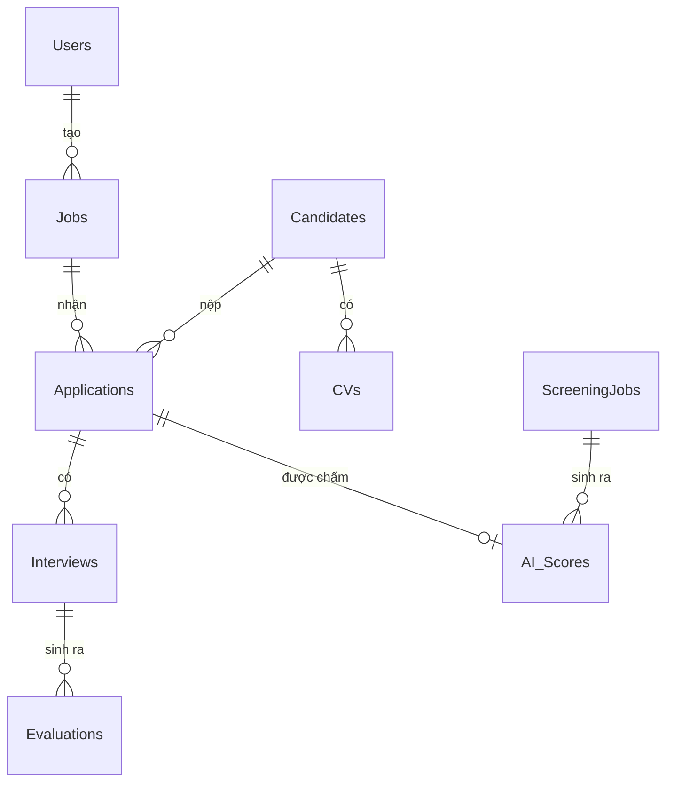

# Thiết kế cơ sở dữ liệu

> TV1 phụ trách tài liệu này. Cập nhật trong tuần 2.

## 1. Các thực thể chính

| Bảng | Mô tả |
|---|---|
| `Users` | Tài khoản đăng nhập |
| `Roles` | Vai trò: Quản trị / HR / Nhà tuyển dụng |
| `Jobs` | Tin tuyển dụng, mô tả công việc (JD) |
| `Candidates` | Ứng viên |
| `CVs` | Hồ sơ đính kèm của ứng viên |
| `Applications` | Lượt ứng tuyển, trạng thái |
| `Interviews` | Vòng phỏng vấn, lịch hẹn |
| `Evaluations` | Đánh giá của người phỏng vấn |
| `AI_Scores` | Điểm phù hợp + tóm tắt do AI sinh, **kèm cờ đã được người xác nhận** |
| `ScreeningJobs` | Một lượt sàng lọc lô CV: trạng thái, tiến độ, người khởi tạo |

**Hệ quản trị: PostgreSQL 16**, kết nối qua Npgsql (lý do chọn: `architecture.md` mục 3.4).
Viết bằng LINQ, **không dùng raw SQL** — đó là điều kiện để giữ khả năng đổi hệ quản trị.

## 2. ERD

> Dán sơ đồ ERD vào đây (ảnh hoặc mermaid).

## 3. Ghi chú thiết kế

- **`AI_Scores` phải có cờ `IsHumanReviewed`** — đây là cơ chế fallback khi AI sai: HR xác nhận
  hoặc hiệu chỉnh điểm, hệ thống ghi lại để cải thiện.
- **`AI_Scores` phải tách khỏi bảng nghiệp vụ** và không bao giờ ghi đè `Applications.Status`:
  điểm AI là thông tin bổ trợ, quyết định vẫn của con người (`architecture.md` — RB9).
- Ba cột nữa mà kiến trúc bất đồng bộ bắt buộc phải có (`architecture.md` — ADR-02):
  - `SummaryStatus` — *chưa chấm* / *đang chấm* / *đã chấm* / *không chấm được*. Thiếu cột này
    thì giao diện không phân biệt được "AI chưa chạy" với "AI chấm 0 điểm".
  - `CacheKey` — `hash(nội dung CV) + hash(JD) + phiên bản prompt + mã mô hình`. Đây là cơ chế
    cắt chi phí gọi API lớn nhất của hệ thống; cần **unique index** trên cột này.
  - `ModelVersion` + `PromptVersion` — để giải thích được vì sao điểm hôm nay khác hôm qua.
- **`ScreeningJobs`** giữ trạng thái một lượt sàng lọc lô (`Queued` / `Running` / `Done` /
  `Failed`) cùng số CV đã xong trên tổng số, để giao diện hiển thị tiến độ `180/300`.
- File CV lưu ở **filesystem/blob**, CSDL chỉ giữ metadata và đường dẫn.
- Cần index trên `Jobs.Title`, `Candidates.FullName`, `Applications.Status` cho tìm kiếm.

## 4. Cần bổ sung

- [ ] Kiểu dữ liệu và ràng buộc từng cột
- [ ] Chiến lược seed dữ liệu mẫu để demo
- [ ] Chính sách xoá: xoá mềm hay xoá cứng với dữ liệu ứng viên
