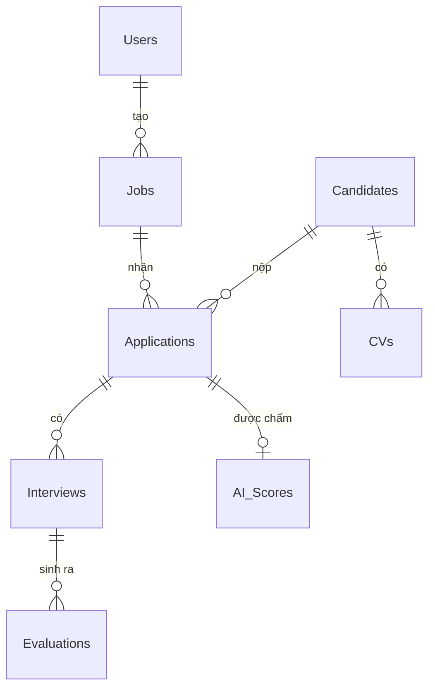

# Thiết kế cơ sở dữ liệu

> TV1 phụ trách tài liệu này. Cập nhật trong tuần 2.

## 1. Các thực thể chính

| Bảng | Mô tả |
|---|---|
| `Users` | Tài khoản đăng nhập |
| `Roles` | Vai trò: Quản trị / HR / Nhà tuyển dụng |
| `Jobs` | Tin tuyển dụng, mô tả công việc (JD) |
| `Candidates` | Ứng viên |
| `CVs` | Hồ sơ đính kèm của ứng viên |
| `Applications` | Lượt ứng tuyển, trạng thái |
| `Interviews` | Vòng phỏng vấn, lịch hẹn |
| `Evaluations` | Đánh giá của người phỏng vấn |
| `AI_Scores` | Điểm phù hợp + tóm tắt do AI sinh, **kèm cờ đã được người xác nhận** |

## 2. ERD

> Dán sơ đồ ERD vào đây (ảnh hoặc mermaid).

## 3. Ghi chú thiết kế

- **`AI_Scores` phải có cờ `IsHumanReviewed`** — đây là cơ chế fallback khi AI sai: HR xác nhận
  hoặc hiệu chỉnh điểm, hệ thống ghi lại để cải thiện.
- File CV lưu ở **filesystem/blob**, CSDL chỉ giữ metadata và đường dẫn.
- Cần index trên `Jobs.Title`, `Candidates.FullName`, `Applications.Status` cho tìm kiếm.

## 4. Cần bổ sung

- [ ] Kiểu dữ liệu và ràng buộc từng cột
- [ ] Chiến lược seed dữ liệu mẫu để demo
- [ ] Chính sách xoá: xoá mềm hay xoá cứng với dữ liệu ứng viên
