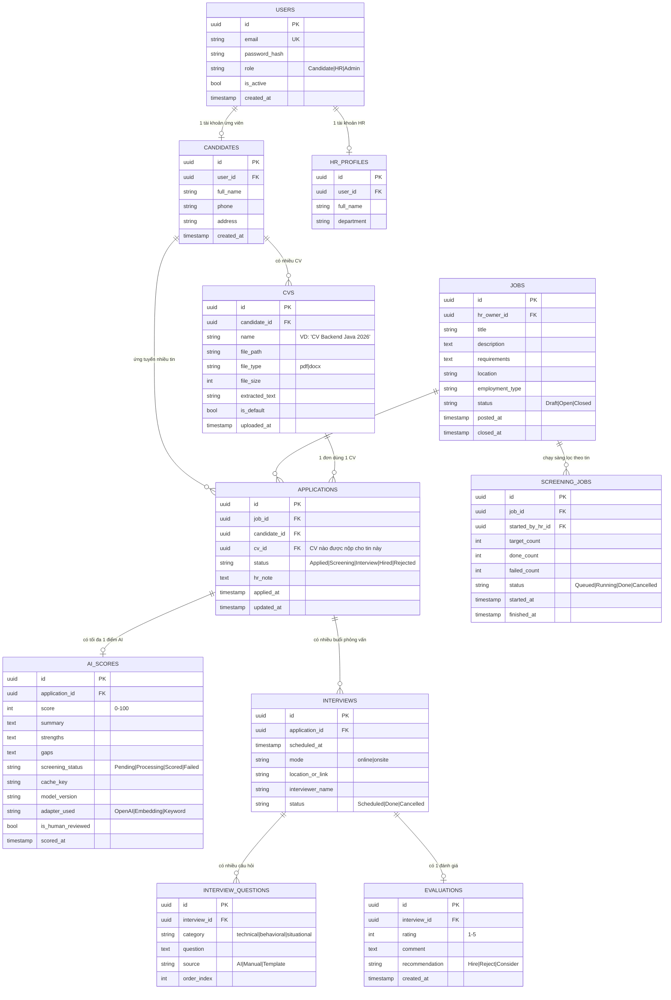

# Thiết kế cơ sở dữ liệu

> TV1 phụ trách tài liệu này. Cập nhật tuần 2.

PostgreSQL 16. **Một `AtsDbContext` dùng chung, tách bảng theo schema** để giữ ranh giới module
mà vẫn dễ migration/join.

## 1. Sơ đồ ER (mermaid)

## 2. Bảng theo schema

### Schema `identity`

| Bảng | Mục đích |
|---|---|
| `identity.users` | Tài khoản chung — cả Ứng viên, HR, Admin |
| `identity.candidates` | Hồ sơ cá nhân của Ứng viên (1-1 với users nếu role=Candidate) |
| `identity.hr_profiles` | Hồ sơ HR (1-1 với users nếu role=HR) |

### Schema `recruitment`

| Bảng | Mục đích |
|---|---|
| `recruitment.cvs` | Nhiều CV/ứng viên — điểm khác biệt so với bản trước |
| `recruitment.jobs` | Tin tuyển dụng, HR sở hữu |
| `recruitment.applications` | Bản đơn ứng tuyển: candidate + job + **cv** + trạng thái |
| `recruitment.interviews` | Buổi phỏng vấn của một application |
| `recruitment.evaluations` | Đánh giá sau phỏng vấn |

### Schema `aiscreening`

| Bảng | Mục đích |
|---|---|
| `aiscreening.ai_scores` | Điểm & tóm tắt AI cho một application (0..1) |
| `aiscreening.screening_jobs` | Lô sàng lọc HR chạy (tracking tiến độ) |
| `aiscreening.interview_questions` | Câu hỏi phỏng vấn (nguồn: AI/Manual/Template) |

## 3. Ràng buộc dữ liệu quan trọng

1. **`applications.cv_id` phải thuộc về đúng `applications.candidate_id`.** Enforce bằng trigger
   hoặc kiểm tra ở Application layer trước khi INSERT.
2. **`(application_id)` là UNIQUE trong `ai_scores`.** Một đơn có tối đa một điểm AI (chấm lại thì
   update, không insert dòng mới).
3. **`cache_key = SHA256(cv_hash || jd_hash || prompt_version || model_version)`.** Index để
   lookup nhanh.
4. **`cvs.is_default`**: chỉ 1 CV `is_default=true` per candidate (partial unique index).
5. **`applications` không được xóa vật lý**, chỉ set `status=Rejected` — để giữ lịch sử.

## 4. Index

| Bảng | Cột | Loại | Vì sao |
|---|---|---|---|
| `applications` | `(job_id, status)` | btree | HR lọc theo tin + trạng thái |
| `applications` | `(candidate_id)` | btree | Ứng viên xem lịch sử |
| `ai_scores` | `cache_key` | hash | Lookup cache trước khi gọi LLM |
| `ai_scores` | `(application_id, score DESC)` | btree | Xếp hạng theo điểm |
| `cvs` | `(candidate_id, is_default)` partial | btree | Tìm CV default |
| `users` | `email` | unique | Đăng nhập |

## 5. Migration đầu tiên

Một EF migration duy nhất `20260920_InitialCreate` tạo cả 3 schema + toàn bộ bảng. Không split
theo module ở phase 1 — split khi nào thực sự tách microservices.

## 6. Seed data cho dev

Script `docker/seed.sql` tạo sẵn:
- 1 admin (`admin@ats.local` / `Admin@123`)
- 3 HR test
- 5 ứng viên test, mỗi ứng viên 2 CV giả
- 10 tin tuyển dụng
- 30 application phân bổ trạng thái

Chạy tự động khi container `db` khởi động.

## 7. Backup & retention

- CV file gốc: lưu trong volume `./data/cvs/` — không backup (đồ án học)
- Database: `pg_dump` thủ công trước mỗi lần deploy demo
- PII: không log query có `full_name`, `phone`, `email` (RB3)
