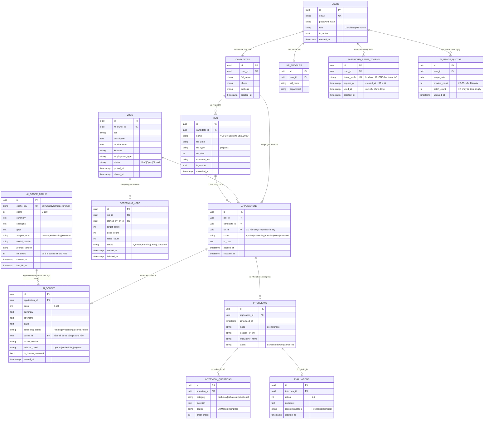

# Thiết kế cơ sở dữ liệu

> TV1 phụ trách tài liệu này. Cập nhật tuần 2.

PostgreSQL 16. **Một `AtsDbContext` dùng chung, tách bảng theo schema** để giữ ranh giới module
mà vẫn dễ migration/join.

## 1. Sơ đồ ER (mermaid)



## 2. Bảng theo schema

Nguyên tắc chia schema: **bảng thuộc schema của module sở hữu entity tương ứng trong code.**
`identity` chỉ giữ thứ phục vụ xác thực; hồ sơ nghiệp vụ thuộc `recruitment` vì `Candidate` là
entity của `Recruitment.Domain` (`ICandidateRepository` nằm ở đó, xem `contracts.md` mục 2.1).

### Schema `identity`

| Bảng | Mục đích |
|---|---|
| `identity.users` | Tài khoản chung — cả Ứng viên, HR, Admin. Chỉ email + mật khẩu + vai |
| `identity.password_reset_tokens` | Token "quên mật khẩu", lưu **hash**, hết hạn 30 phút, dùng một lần |

### Schema `recruitment`

| Bảng | Mục đích |
|---|---|
| `recruitment.candidates` | Hồ sơ cá nhân của Ứng viên (1-1 với `users` khi role=Candidate) |
| `recruitment.hr_profiles` | Hồ sơ HR (1-1 với `users` khi role=HR) |
| `recruitment.cvs` | Nhiều CV/ứng viên — điểm khác biệt so với bản trước |
| `recruitment.jobs` | Tin tuyển dụng, HR sở hữu |
| `recruitment.applications` | Bản đơn ứng tuyển: candidate + job + **cv** + trạng thái |
| `recruitment.interviews` | Buổi phỏng vấn của một application |
| `recruitment.evaluations` | Đánh giá sau phỏng vấn |

### Schema `aiscreening`

| Bảng | Mục đích |
|---|---|
| `aiscreening.ai_scores` | **Ảnh chụp** điểm AI của một đơn ứng tuyển — thứ HR đã nhìn thấy |
| `aiscreening.ai_score_cache` | **Kho tra cứu** theo nội dung, không gắn với đơn nào |
| `aiscreening.screening_jobs` | Lô sàng lọc HR chạy (tracking tiến độ) |
| `aiscreening.interview_questions` | Câu hỏi phỏng vấn (nguồn: AI/Manual/Template) |
| `aiscreening.ai_usage_quotas` | Bộ đếm hạn mức AI theo (user, ngày) — hiện thực RB2 |

#### `ai_scores` và `ai_score_cache` khác nhau chỗ nào

Đây là hai khái niệm khác nhau, gộp chung là sai:

| | `ai_score_cache` | `ai_scores` |
|---|---|---|
| Khoá theo | **Nội dung**: CV + JD + model + prompt | **Đơn ứng tuyển**: `application_id` |
| Tồn tại khi chưa có đơn? | **Có** — ứng viên preview trước khi nộp (UC-05) | Không |
| Dùng lại giữa nhiều đơn? | Có — 2 ứng viên nộp cùng một CV vào cùng tin thì trúng chung | Không |
| Khi đổi `prompt_version` | Dòng cũ thành vô dụng, ghi dòng mới | Giữ nguyên — đó là điểm HR đã thấy |

Vì vậy `ai_scores` sao chép lại `score`/`summary` tại thời điểm chấm thay vì chỉ trỏ sang
cache. Trùng lặp này **là cố ý**: nếu sau đó nhóm đổi prompt, hồ sơ vẫn còn đúng con số mà HR
đã căn cứ để ra quyết định.

## 3. Ràng buộc dữ liệu quan trọng

1. **`applications.cv_id` phải thuộc về đúng `applications.candidate_id`.** Enforce bằng trigger
   hoặc kiểm tra ở Application layer trước khi INSERT.
2. **`(application_id)` là UNIQUE trong `ai_scores`.** Một đơn có tối đa một điểm AI (chấm lại thì
   update, không insert dòng mới).
3. **`cache_key` là UNIQUE trong `ai_score_cache`**, giá trị
   `SHA256(cv_text || jd_text || model_version || prompt_version)`. Bảng này **không có**
   `application_id` — đó chính là lý do phải tách khỏi `ai_scores`: ứng viên xem preview khi
   chưa nộp đơn (UC-05), lúc đó chưa tồn tại `Application` nào để tham chiếu. Mọi lượt chấm,
   preview lẫn sàng lọc lô, đều tra bảng này trước khi gọi LLM.
4. **`cvs.is_default`**: chỉ 1 CV `is_default=true` per candidate (partial unique index).
5. **`applications` không được xóa vật lý**, chỉ set `status=Rejected` — để giữ lịch sử.
6. **`(user_id, usage_date)` là UNIQUE trong `ai_usage_quotas`.** Tăng bộ đếm bằng
   `INSERT ... ON CONFLICT (user_id, usage_date) DO UPDATE SET preview_count = preview_count + 1`
   — một câu lệnh nguyên tử, không cần lock ở tầng ứng dụng.
7. **`password_reset_tokens` lưu `token_hash`, không lưu token thô.** Rò database thì kẻ tấn
   công vẫn không đặt lại được mật khẩu. Token dùng một lần (`used_at`), hết hạn sau 30 phút.
8. **`ai_scores.cache_id` cho phép NULL.** Khi `KeywordScoringAdapter` chạy (không gọi LLM,
   không tốn tiền) thì không cần ghi cache.

## 4. Index

| Bảng | Cột | Loại | Vì sao |
|---|---|---|---|
| `applications` | `(job_id, status)` | btree | HR lọc theo tin + trạng thái |
| `applications` | `(candidate_id)` | btree | Ứng viên xem lịch sử |
| `ai_score_cache` | `cache_key` | unique btree | Lookup cache trước khi gọi LLM |
| `ai_scores` | `application_id` unique, `INCLUDE (score, screening_status)` | btree | Covering index cho truy vấn xếp hạng dưới đây |
| `ai_usage_quotas` | `(user_id, usage_date)` | unique btree | Đếm hạn mức trong ngày (RB2) |
| `password_reset_tokens` | `token_hash` | unique btree | Tra token khi đặt lại mật khẩu |
| `cvs` | `(candidate_id, is_default)` partial | btree | Tìm CV default |
| `users` | `email` | unique | Đăng nhập |

### 4.1. Vì sao không có index `(application_id, score DESC)`

Truy vấn nghiệp vụ thật không phải "xếp hạng theo `application_id`" mà là **"xếp hạng ứng viên
của tin X theo điểm giảm dần"**. Mà `ai_scores` **không có** cột `job_id`:

```sql
SELECT a.id, a.candidate_id, s.score, s.summary, s.adapter_used
FROM   recruitment.applications a
LEFT   JOIN aiscreening.ai_scores s ON s.application_id = a.id
WHERE  a.job_id = @jobId
ORDER  BY s.score DESC NULLS LAST;
```

Lọc xảy ra ở `applications(job_id, status)`; `ai_scores` chỉ bị tra theo `application_id`, mà
cột đó là UNIQUE — mỗi khoá đúng một dòng, nên thêm `score DESC` vào index **không sắp xếp
được gì cả**. Index đúng là index **covering**: `INCLUDE (score, screening_status)` để phép
join lấy luôn điểm mà không phải đọc heap.

`LEFT JOIN` + `NULLS LAST` là bắt buộc, không phải tuỳ chọn: hồ sơ chưa chấm hoặc "Không chấm
được" vẫn phải hiện trong danh sách (RB9).

**Dấu hiệu phải xem lại:** khi một tin có > 5.000 hồ sơ và phép join thành nút cổ chai → lúc
đó mới thêm `job_id` denormalized vào `ai_scores` kèm index `(job_id, score DESC)`, và chấp
nhận phải giữ đồng bộ cột đó.

## 5. Migration đầu tiên

Migration `20260919131605_InitialCreate` (đã tạo ở tuần 2) **chỉ tạo 3 schema**, chưa có bảng
nào — đúng theo kế hoạch: tuần 2 dựng khung, tuần 3 trở đi mỗi module mới thêm bảng của mình.

EF không tự sinh `EnsureSchema` khi model chưa có entity nào, nên ba dòng đó viết tay trong
`Up()`. Từ tuần 3, EF tự thêm `EnsureSchema` cho bảng mới.

Không split migration theo module ở phase 1 — split khi nào thực sự tách microservices.

Ba thứ EF Core không sinh được từ model, phải viết tay bằng `migrationBuilder.Sql(...)` ngay
trong migration này:

```sql
CREATE UNIQUE INDEX ix_cvs_default ON recruitment.cvs (candidate_id) WHERE is_default;

ALTER TABLE recruitment.applications ADD CONSTRAINT ck_applications_cv_owner
  CHECK (public.fn_cv_belongs_to_candidate(cv_id, candidate_id));  -- ràng buộc 1, mục 3

CREATE INDEX ix_ai_scores_app ON aiscreening.ai_scores (application_id)
  INCLUDE (score, screening_status);
```

## 6. Seed data cho dev

Script `docker/seed.sql` tạo sẵn:
- 1 admin (`admin@ats.local` / `Admin@123`)
- 3 HR test
- 5 ứng viên test, mỗi ứng viên 2 CV giả
- 10 tin tuyển dụng
- 30 application phân bổ trạng thái
- 30 dòng `ai_score_cache` tương ứng → demo chạy được **không cần** `OPENAI_API_KEY`

Chạy tự động khi container `db` khởi động.

## 7. Backup & retention

- CV file gốc: lưu trong volume `./data/cvs/` — không backup (đồ án học)
- Database: `pg_dump` thủ công trước mỗi lần deploy demo
- PII: không log query có `full_name`, `phone`, `email` (RB3)
