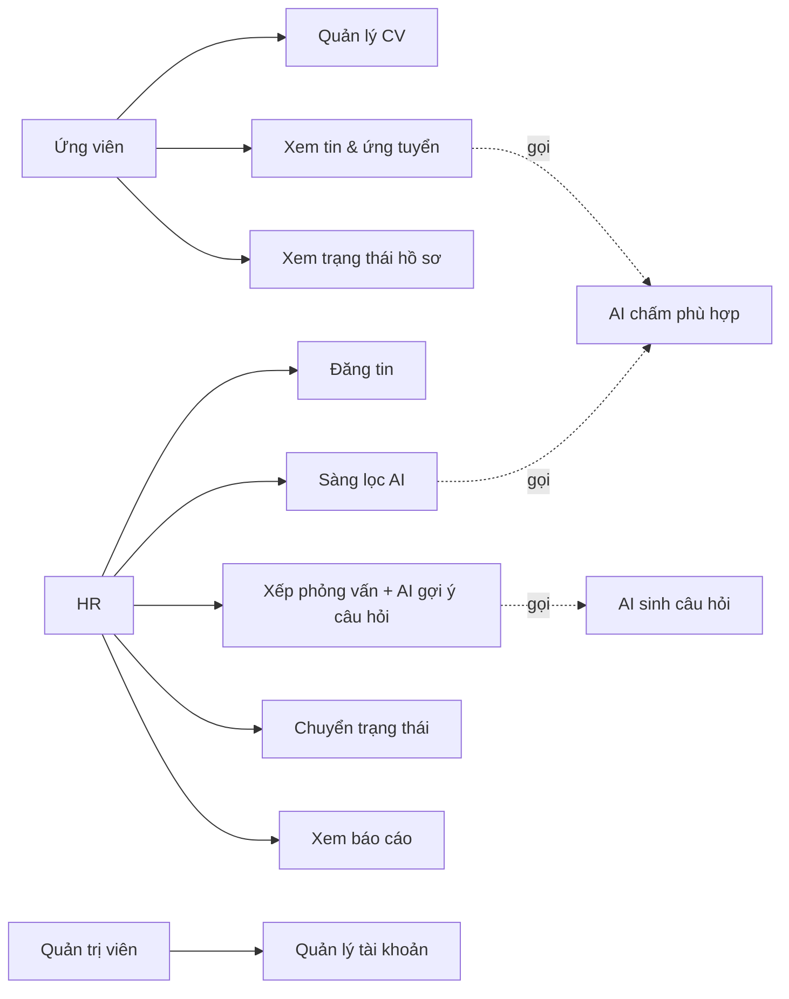

# Use case

> TV2 phụ trách tài liệu này. Cập nhật trong tuần 1.

## 1. Tác nhân

| Tác nhân | Vai | Mô tả |
|---|---|---|
| **Ứng viên** | Chủ thể nghiệp vụ | Người bên ngoài, đăng ký tài khoản, quản lý nhiều CV, tự ứng tuyển vào tin |
| **HR** | Chủ thể nghiệp vụ | Người của tổ chức tuyển dụng: đăng tin, quản lý ứng viên, sàng lọc, phỏng vấn |
| Quản trị viên | Vai kỹ thuật | Quản lý tài khoản, phân quyền — không tham gia nghiệp vụ tuyển dụng |

## 2. Use case chính

### 2.1. Ứng viên

```
Ứng viên
  ├── Đăng ký / đăng nhập
  ├── Quên mật khẩu → nhận email đặt lại (token hết hạn 30 phút, dùng 1 lần)
  ├── Cập nhật hồ sơ cá nhân
  ├── Quản lý CV (nhiều CV cùng lúc)
  │     ├── Upload CV mới (PDF/DOCX)
  │     ├── Đặt tên / mô tả CV
  │     ├── Chọn CV mặc định
  │     └── Xóa CV
  ├── Xem danh sách tin tuyển dụng
  │     └── Tìm kiếm, lọc theo vị trí / kỹ năng
  ├── Xem chi tiết tin
  ├── ⭐ Ứng tuyển: chọn 1 trong các CV → nộp
  │     └── AI chấm % phù hợp trước khi nộp (xem để cân nhắc)
  ├── Xem lịch sử ứng tuyển
  │     └── Xem trạng thái từng hồ sơ đã nộp
  └── Xem điểm phù hợp & tóm tắt của mình
```

### 2.2. HR

```
HR
  ├── Đăng nhập / quên mật khẩu
  ├── Đăng / sửa / đóng tin tuyển dụng
  ├── Xem danh sách ứng viên đã nộp vào tin mình quản lý
  │     └── Xem điểm AI (nếu đã chấm) — xếp hạng theo điểm
  ├──  Khởi chạy sàng lọc AI cho tin (nền, hàng loạt)
  ├── Theo dõi tiến độ sàng lọc (đã xong 180/300)
  ├── Xem chi tiết hồ sơ ứng viên
  │     ├── Xem CV (bản gốc)
  │     ├── Xem tóm tắt AI + điểm phù hợp + lý do
  │     └── Ghi chú riêng
  ├── Chuyển trạng thái ứng tuyển (theo state machine)
  ├── Xếp lịch phỏng vấn
  │     └──  AI sinh bộ câu hỏi phỏng vấn từ JD + CV
  ├── Nhập đánh giá sau phỏng vấn
  └── Xem báo cáo & thống kê
```

### 2.3. Quản trị viên

```
Quản trị viên
  ├── Quản lý tài khoản (khóa/mở, đặt lại mật khẩu)
  └── Xem log hệ thống
```

## 3. Sơ đồ use case (mermaid)



## 4. Trạng thái ứng tuyển (state machine)

```
Đã nộp → Sàng lọc → Phỏng vấn → Nhận
              ↘             ↘
                Từ chối       Từ chối
```

**Quy tắc:**
- Chỉ HR được chuyển trạng thái, ứng viên chỉ xem
- Không được nhảy cóc từ "Đã nộp" thẳng sang "Nhận"
- Trạng thái không tự động chuyển theo điểm AI (RB9)

## 5. Trạng thái sàng lọc AI — tách riêng khỏi trạng thái ứng tuyển

```
Chưa chấm → Đang chấm → Đã chấm
                    ↘
                      Không chấm được  (LLM lỗi / PDF hỏng / hết fallback)
```

**Ràng buộc:** hai chuỗi trạng thái này **độc lập**. HR vẫn xem CV, vẫn chuyển trạng thái ứng
tuyển bình thường khi cột điểm AI còn trống hoặc `Không chấm được`. Không màn hình nào được
chặn thao tác vì thiếu điểm AI.

## 6. Đặc tả 6 use case quan trọng nhất

### UC-01: Ứng viên upload CV

- **Tác nhân**: Ứng viên
- **Tiền điều kiện**: Đã đăng nhập
- **Luồng chính**:
  1. Ứng viên chọn "Thêm CV mới"
  2. Chọn file PDF hoặc DOCX (≤ 5 MB)
  3. Nhập tên CV (ví dụ "CV Backend Java 2026")
  4. Hệ thống lưu file, tạo bản ghi `Cv`
  5. Hệ thống trích xuất text nền (không chặn UI)
- **Luồng phụ**:
  - File > 5 MB → báo lỗi
  - File không đọc được text → cho phép nhưng đánh dấu `text_extractable = false`, AI sẽ không chấm được
- **Kết quả**: CV xuất hiện trong danh sách CV của ứng viên

### UC-02: Ứng viên ứng tuyển vào tin

- **Tác nhân**: Ứng viên
- **Tiền điều kiện**: Đã đăng nhập, có ít nhất 1 CV, tin đang mở
- **Luồng chính**:
  1. Ứng viên xem chi tiết tin
  2. Bấm "Ứng tuyển"
  3. Chọn 1 CV trong danh sách CV của mình (mặc định là CV default)
  4. Xác nhận → hệ thống tạo bản ghi `Application(candidateId, jobId, cvId, status=Đã nộp)`
  5. Hệ thống enqueue sàng lọc AI cho `Application` này
  6. Trả về màn hình chờ; điểm phù hợp hiện lên khi AI xong (polling 3s)
- **Luồng phụ**:
  - Đã ứng tuyển tin này rồi với CV khác → hỏi có muốn thay CV không
  - Chưa có CV → chuyển sang màn upload CV trước
- **Kết quả**: có bản ghi Application mới, ứng viên nhìn thấy điểm và tóm tắt AI

### UC-03: HR chạy sàng lọc AI hàng loạt

- **Tác nhân**: HR
- **Tiền điều kiện**: HR sở hữu tin, có ≥ 1 hồ sơ chưa chấm
- **Luồng chính**:
  1. HR mở màn "Ứng viên của tin X"
  2. Bấm "Chạy sàng lọc AI cho tất cả chưa chấm"
  3. Hệ thống tạo `ScreeningJob(jobId, targetCount=200)`, enqueue mỗi ứng viên
  4. Trả 202 Accepted + `screeningJobId`
  5. UI hiện progress bar polling `GET /screening-jobs/{id}` mỗi 2s
  6. Khi xong: bảng ứng viên tự sắp xếp theo điểm giảm dần
- **Luồng phụ**:
  - Vài hồ sơ CV lỗi → status = "Không chấm được", vẫn hiện trong danh sách
  - LLM hết quota → rơi xuống EmbeddingAdapter → KeywordAdapter (adapter cuối luôn chạy được)
- **Kết quả**: mỗi Application có `AiScore` (hoặc trạng thái "Không chấm được")

### UC-04: HR xếp phỏng vấn + AI gợi ý câu hỏi

- **Tác nhân**: HR
- **Tiền điều kiện**: Application ở trạng thái "Sàng lọc"
- **Luồng chính**:
  1. HR bấm "Hẹn phỏng vấn" trên một ứng viên
  2. Nhập thời gian, hình thức (online/onsite), người phỏng vấn
  3. Bấm "Gợi ý câu hỏi" → gọi `IInterviewQuestionGenerator` với CV + JD
  4. AI trả về 8–12 câu hỏi, chia nhóm (chuyên môn, tình huống, hành vi)
  5. HR có thể sửa/xóa/thêm câu hỏi tự viết
  6. Lưu `Interview` + câu hỏi **trước**, rồi mới gửi email mời phỏng vấn qua `IEmailSender`
- **Luồng phụ**:
  - AI lỗi → dùng `TemplateInterviewQuestionAdapter` (câu hỏi mẫu theo vị trí)
  - HR có thể bỏ qua bước AI, nhập câu hỏi thủ công
  - **SMTP lỗi → buổi phỏng vấn VẪN được lưu.** Gửi email là việc phụ, không nằm trong
    transaction. Hệ thống đánh dấu `email_sent = false` và hiện nút "Gửi lại lời mời" cho HR.
    Không bao giờ rollback một buổi phỏng vấn chỉ vì không gửi được mail
  - Dev/demo dùng container MailHog, xem mail ở `http://localhost:8025` — không gửi ra Internet
- **Kết quả**: Interview được lưu, câu hỏi đính kèm, ứng viên nhận email (hoặc HR gửi lại sau)

### UC-05: Ứng viên xem điểm phù hợp trước khi nộp

- **Tác nhân**: Ứng viên
- **Tiền điều kiện**: Đăng nhập, đã có CV
- **Kiểu gọi**: **ĐỒNG BỘ** — `POST /api/ai/score-preview` trả thẳng `200 OK`, timeout cứng
  30 giây. Đây là **ngoại lệ có chủ đích** của ADR-2 (sàng lọc lô thì bất đồng bộ), vì đây chỉ
  là một cặp CV↔JD và giá trị của nó nằm ở chỗ trả lời ngay trên màn hình. Lý do đầy đủ ở
  `architecture.md` ADR-2.
- **Luồng chính**:
  1. Ứng viên xem chi tiết tin
  2. Chọn CV muốn dùng
  3. Bấm "Xem độ phù hợp"
  4. Hệ thống tra `aiscreening.ai_score_cache` theo
     `CacheKey(cvText, jdText, modelVersion, promptVersion)`
     - **Trúng cache** → trả ngay, **không trừ hạn mức** (không tốn tiền thì không tính)
     - **Trượt cache** → kiểm tra hạn mức trước, rồi mới chấm mới và ghi cache
  5. Hiển thị: điểm 0–100, kỹ năng match, kỹ năng thiếu, **nhãn nguồn điểm**
     (AI / Ngữ nghĩa / Từ khoá) và số lượt còn lại trong ngày
- **Luồng phụ**:
  - Ứng viên chấm lại nhiều lần cùng CV+JD → tất cả trúng cache, không tốn tiền, không trừ lượt
  - **Hết hạn mức 20 lượt/ngày** → `429`, hiện thời điểm reset. Ứng viên vẫn nộp đơn được bình
    thường; preview là tiện ích, không phải điều kiện để ứng tuyển
  - **Quá 30 giây** → rơi xuống `KeywordScoringAdapter`, vẫn trả điểm, nhãn ghi rõ "Từ khoá"
  - CV chưa trích xuất được text → báo "chưa chấm được CV này", gợi ý chọn CV khác
- **Kết quả**: ứng viên biết được có nên nộp hay không, và biết con số đó đáng tin đến mức nào

### UC-06: Quên mật khẩu

- **Tác nhân**: Ứng viên hoặc HR
- **Tiền điều kiện**: không (chưa đăng nhập được)
- **Luồng chính**:
  1. Người dùng nhập email ở màn "Quên mật khẩu"
  2. Hệ thống **luôn trả `204 No Content`**, bất kể email có tồn tại hay không — không để
     kẻ tấn công dò xem địa chỉ nào đã đăng ký
  3. Nếu email có thật: sinh token ngẫu nhiên, lưu **hash** của token vào
     `identity.password_reset_tokens` (hết hạn 30 phút), gửi link qua `IEmailSender`
  4. Người dùng mở link → nhập mật khẩu mới → `POST /api/auth/reset-password`
  5. Hệ thống kiểm tra token: còn hạn, chưa dùng, khớp hash → đổi mật khẩu,
     đánh dấu `used_at`, **vô hiệu mọi token còn lại** của user đó
- **Luồng phụ**:
  - Token hết hạn hoặc đã dùng → báo lỗi chung "link không hợp lệ hoặc đã hết hạn", yêu cầu
    gửi lại. Không nói rõ là lỗi nào
  - SMTP lỗi → ghi log, người dùng thử lại sau. Không lộ lỗi hạ tầng ra màn hình
- **Kết quả**: đổi được mật khẩu mà không cần admin can thiệp

## 7. Ràng buộc và phi chức năng

- **Bảo mật:** Ứng viên chỉ được đọc/ghi trên `candidate_id = user.candidate_id` của mình. HR
  chỉ được thao tác trên tin mà mình là owner. (RB8)
- **PII:** Không CV thô nào được gửi lên LLM. Chỉ `AnonymizedCv` (không tên, SĐT, email, địa
  chỉ, tên trường học cụ thể, tên công ty cụ thể — chỉ giữ kỹ năng, kinh nghiệm, mô tả công
  việc). (RB3)
- **Chi phí:** Cache mọi lượt chấm ở `aiscreening.ai_score_cache` theo `CacheKey`. Rate-limit
  ứng viên preview 20 lượt/ngày, HR 5 lô/ngày — bộ đếm ở `aiscreening.ai_usage_quotas`. Trúng
  cache không trừ lượt. (RB2)
- **UX chờ:** Thao tác hàng loạt (sàng lọc lô) bắt buộc bất đồng bộ + progress bar. Thao tác
  đơn lẻ (preview một CV) được phép đồng bộ nhưng **phải có timeout cứng 30s** và phải hiện
  trạng thái chờ. Không màn hình nào được treo vô hạn.
- **Tính chính trực của điểm AI:** mọi chỗ hiển thị điểm **phải kèm nguồn** (`AdapterUsed`:
  AI / Ngữ nghĩa / Từ khoá). Ba tầng fallback cho ba thang điểm khác nhau; hiện con số trần
  sẽ khiến HR so sánh hai đại lượng không cùng đơn vị. Xem `ai-integration.md` mục 5.
